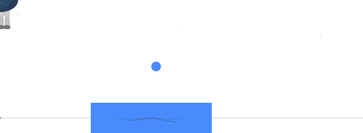

---

## Hey there, I'm Carlos 

**Business Analytics MSc @ Esade · Data & Strategy · Builder**

Business background, builder mindset. I’m finishing an MSc in Business Analytics at ESADE. With 2 years of experience in market analysis and marketing at SoftwareOne and TTNL, I’m focused on building practical SaaS products—tools that solve real problems, not just software for its own sake.

 Barcelona ·  Lived in South Africa, The Netherlands, Spain
 English · Dutch · Afrikaans

---

##  What I Build

*I like turning messy problems into tools you can actually use. Here's what I'm building:*

  

<table>
<tr>
<td width="50%" valign="top">

###  [Notiq](https://github.com/CarlosvdK/Notiq)
AI-powered note-taking app that turns messy thoughts into clear, searchable notes.

[`View Repo →`](https://github.com/CarlosvdK/Notiq)

</td>
<td width="50%" valign="top">

###  [N26](https://github.com/CarlosvdK/N26-)
A digestible news feed built to make staying informed fast and simple.

[`View Repo →`](https://github.com/CarlosvdK/N26-)

</td>
</tr>
<tr>
<td width="50%" valign="top">

###  [F1 Tyre Strategy Model](https://github.com/CarlosvdK/f1_tyre_prediction)
ML model that predicts optimal F1 pit stop timing and tyre compound using Gradient Boosting on ~93k real laps.

[`View Repo →`](https://github.com/CarlosvdK/f1_tyre_prediction)

</td>
<td width="50%" valign="top">

###  [Trading Bot](https://github.com/CarlosvdK/trading_bot)
Automated trading bot with risk management, regime detection, backtesting, and a live dashboard.

[`View Repo →`](https://github.com/CarlosvdK/trading_bot)

</td>
</tr>
<tr>
<td width="50%" valign="top">

###  [Code Explainer](https://github.com/CarlosvdK/code-explainer)
Tool for breaking down and explaining codebases to make them easier to understand.

[`View Repo →`](https://github.com/CarlosvdK/code-explainer)

</td>
<td width="50%" valign="top">

###  [Prompt Platform](https://github.com/CarlosvdK/prompt-platform)
Platform for managing, testing, and optimising AI prompts.

[`View Repo →`](https://github.com/CarlosvdK/prompt-platform)

</td>
</tr>
<tr>
<td width="50%" valign="top">

###  [FaceID Attendance](https://github.com/CarlosvdK/Face-Attendance_assignment)
Face recognition attendance system for quick, automated check-ins.

[`View Repo →`](https://github.com/CarlosvdK/Face-Attendance_assignment)

</td>
</tr>
</table>

---

##  Tech Stack

**Languages & Analysis**

**Frameworks & Tools**

**Data & ML**

---

##  About Me

-  Completing an **MSc in Business Analytics** @ **ESADE Business School**
-  Based in **Barcelona** — Dutch/Afrikaans background
-  Studied **International Business**, with a strong interest in how products win in new markets
-  ~2 years in **market analysis & marketing** (SoftwareOne + TTNL), including market-entry work
-  Currently exploring **machine learning** + **automation** to build practical **SaaS tools** for companies
-  Languages: **English · Dutch · Afrikaans**

---

##  Let's Connect

---

##  Contributions

<picture>
  <source media="(prefers-color-scheme: dark)" srcset="https://raw.githubusercontent.com/CarlosvdK/CarlosvdK/output/snake-dark.svg" />
  <source media="(prefers-color-scheme: light)" srcset="https://raw.githubusercontent.com/CarlosvdK/CarlosvdK/output/snake.svg" />
  
</picture>

---

  <i>I like projects where business context meets real building—data in, product out.</i>

